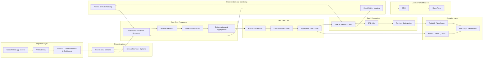

```mermaid
flowchart LR

subgraph ingestion["Ingestion Layer"]
A["Web / Mobile App Events"]
B["API Gateway"]
C["Lambda - Event Validation & Enrichment"]
end

subgraph streaming["Streaming Layer"]
D["Kinesis Data Streams"]
D1["Kinesis Firehose - Optional"]
end

subgraph realtime["Real-Time Processing"]
E["Databricks Structured Streaming"]
E1["Schema Validation"]
E2["Data Transformation"]
E3["Deduplication and Aggregations"]
end

subgraph datalake["Data Lake - S3"]
F1["Raw Zone - Bronze"]
F2["Cleaned Zone - Silver"]
F3["Aggregated Zone - Gold"]
end

subgraph batch["Batch Processing"]
G["Glue or Databricks Jobs"]
G1["ETL Jobs"]
G2["Partition Optimization"]
end

subgraph analytics["Analytics Layer"]
H1["Athena - Adhoc Queries"]
H2["Redshift - Warehouse"]
J["QuickSight Dashboards"]
end

subgraph orchestration["Orchestration and Monitoring"]
I["Airflow - DAG Scheduling"]
M["CloudWatch - Logging"]
end

subgraph alerts["Alerts and Notifications"]
K["SNS"]
L["Slack Alerts"]
end

A --> B
B --> C
C --> D
D --> D1
D --> E
E --> E1
E1 --> E2
E2 --> E3
E3 --> F1
F1 --> F2
F2 --> F3
F3 --> G
G --> G1
G1 --> G2
G2 --> H2
F3 --> H1
H1 --> J
H2 --> J
I --> G
I --> E
E --> M
G --> M
M --> K
K --> L
```
