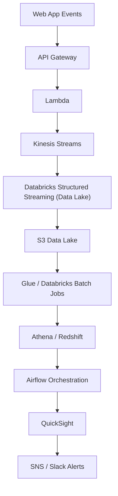

# Project Name

Real-Time Customer Intelligence & Revenue Optimization Platform

## 🚀 Overview
Problem Statement: Companies lose millions due to:
* No real-time visibility of customer behaviour
* Cart abadonment
* Failed Payments
* Fraud users
* ad marketing targeting

Solutions:
* Real-time dashoards
* Customer 360 profiles
* Live alerts
* ML-ready curated datasets

## 🏗️ Architecture
High Level Architecture

## 📌 Features
1. Real-Time Event Ingestion: FAST API microservice (page_view, add_to_cart, checkout, payment), Schema Registry, Lamda validation Layer, Kinesis partitioing strategy
2. Databricks Streaming Layer: Structured Streaming, deduplication, late event handlig, watermarking, data lake bronze/silver/gold layers 
3. Customer 360 Engine: Identity stitching Sessionization, Funnel tracking, Lifetime value computation
4. Revenue Optimization Analytics: Cart abondenmet detection, top leaking funnels, conversion optimization
5. Alerting System: drop in conversion, payment failures  thresold, bot traffix detection, SNS -> Slack alerts
6. Airflow Orchestration: Daily ETL, SLA monitoring, ackfill pipelines, auto-retry, failure routing
7. Cost & Performance Optimization: S3 partitiong, ZORDER in Dataricks, broadcast joins, Delta OPTIMIZE + VACUM, Kinesis shard tuning

## 🛠️ Tech Stack
- Python 
- AWS
- SQL
- Databricks
- FastAPI
- Airflow

## 🧪 How to Run
To be added

## 📈 Future Improvements
To be added
